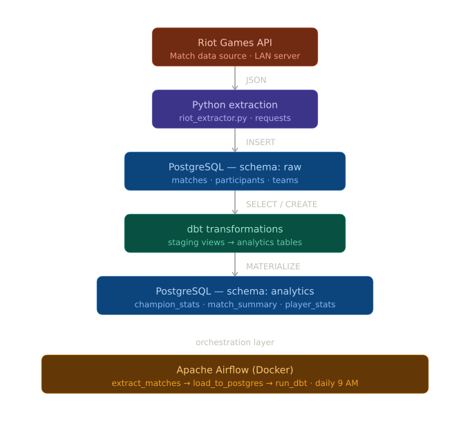
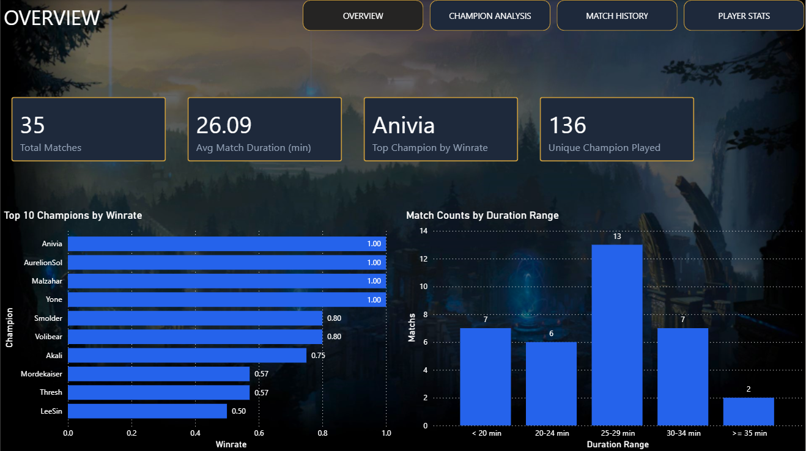
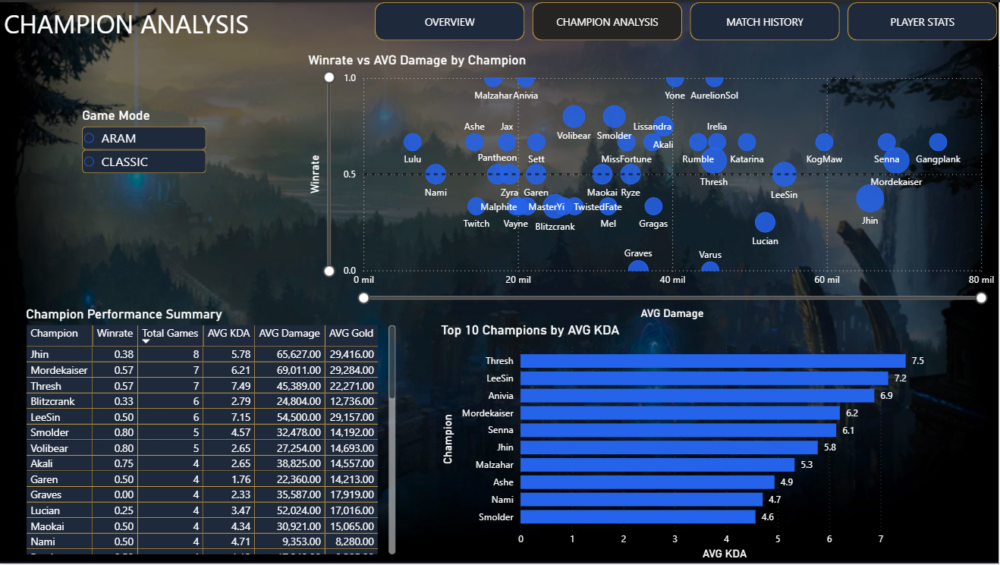
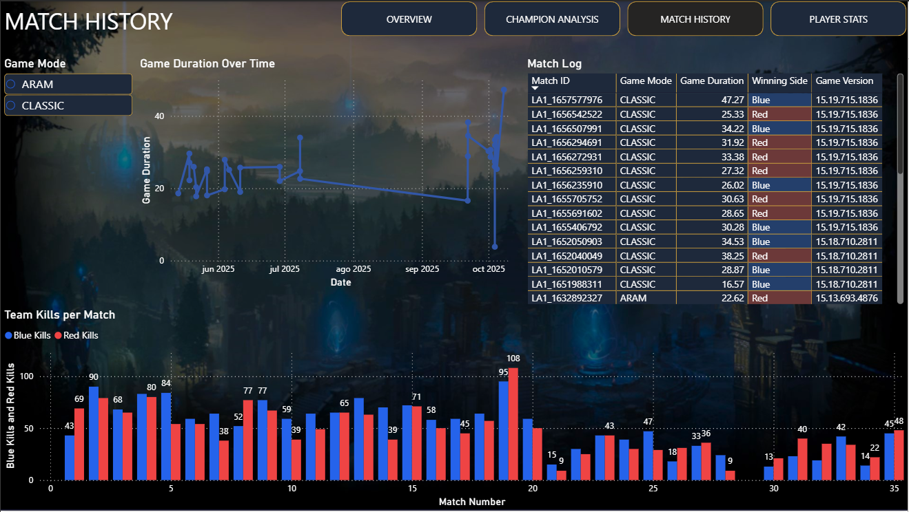
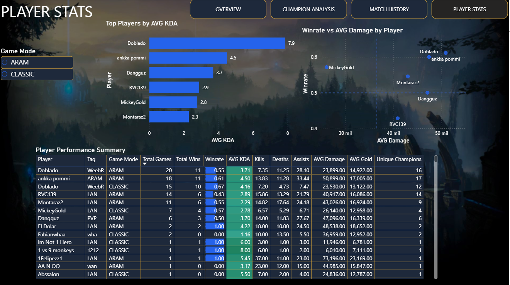

# League of Legends Pipeline

End-to-end data engineering pipeline that extracts, loads, and transforms
League of Legends matches data using the Riot Games API.

## Architecture



## Tech Stack

| Tool | Purpose |
|---|---|
| Python | Data extraction from Riot Games API |
| PostgreSQL | Data storage (raw + analytics layers) |
| dbt | Data transformation and testing |
| Apache Airflow | Pipeline orchestration |
| Docker | Airflow containerization |

## Pipeline Overview

The pipeline runs daily at 9 AM and consists of three automated tasks:

1. **extract_matches** — Fetches the 20 most recent matches for a
   given player from the Riot Games API and saves them as JSON files.

2. **load_to_postgres** — Parses the raw JSON files and loads them into
   PostgreSQL under the `raw` schema across three tables:
   `matches`, `participants`, and `teams`.

3. **run_dbt** — Executes dbt models to transform raw data into clean,
   tested analytics tables under the `analytics` schema.

## Data Models

### Staging Layer (views)
- `staging.stg_matches` — Match metadata with converted timestamps
- `staging.stg_participants` — Player stats with calculated KDA
- `staging.stg_teams` — Team results with side labels (Blue/Red)

### Analytics Layer (tables)
- `analytics.champion_stats` — Win rates, avg KDA, avg damage by champion
- `analytics.match_summary` — Match duration, winning side, kills per team
- `analytics.player_stats` — Aggregated stats per player

## Dashboard

Interactive Power BI dashboard with 4 pages built on top of the `analytics` schema.

### Overview


### Champion Analysis


### Match History


### Player Stats


## Project Structure

```
lol-pipeline/
├── extraction/          # Riot API extraction scripts
├── loading/             # PostgreSQL loading scripts
├── sql/                 # Schema creation SQL
├── dbt/                 # dbt project (transformations + tests)
│   └── lol_dbt/
│       ├── models/
│       │   ├── staging/
│       │   └── marts/
│       └── macros/
├── airflow/             # Airflow DAGs and Docker config
│   └── dags/
├── docs/                # Architecture diagram
├── data/                # Raw JSON files (gitignored)
└── dashboard/           # Power BI .pbix file
```

## Setup

### Prerequisites
- Python 3.10+
- PostgreSQL
- Docker Desktop
- Riot Games API Key ([developer.riotgames.com](https://developer.riotgames.com))

### Installation

1. Clone the repository
```bash
   git clone https://github.com/VladimirGarcia17/lol-pipeline.git
   cd lol-pipeline
```

2. Install Python dependencies
```bash
   pip install requests python-dotenv psycopg2-binary sqlalchemy dbt-postgres
```

3. Configure environment variables
```bash
   cp .env.example .env
   # Edit .env with your credentials
```

4. Create the database schema
```bash
   psql -U postgres -d lol_pipeline -f sql/create_raw_schema.sql
```

5. Start Airflow
```bash
   cd airflow
   docker compose up -d
```

6. Access Airflow UI at `http://localhost:8080` and trigger the
   `lol_pipeline` DAG.

## Author

Vladimir Garcia — [github.com/VladimirGarcia17](https://github.com/VladimirGarcia17)